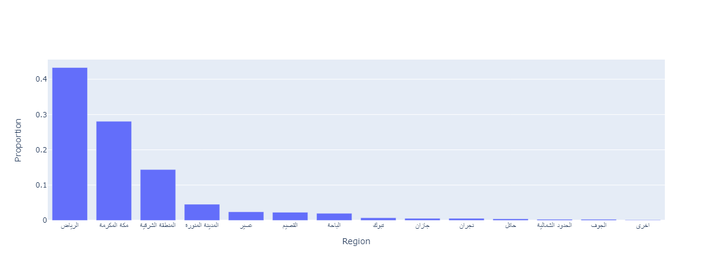
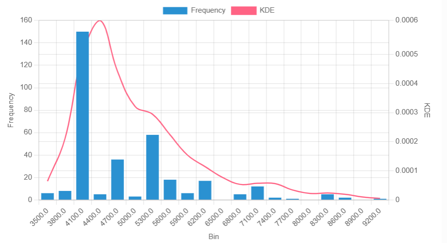

# Saudi Arabia Job Postings Analysis


## 📋 Overview
An interactive data analysis application that provides insights into the Saudi Arabian job market using data collected from Jadarat. This tool helps job seekers understand regional job distribution, salary expectations, and market trends.

## ✨ Features
- **Regional Analysis**: Visualize job posting distribution across Saudi regions
- **Salary Insights**: Explore salary ranges for fresh graduates
- **Interactive Dashboard**: User-friendly Streamlit interface for data exploration
- **Emotional Support**: Integrated resources for job seekers

## 🛠️ Technologies
- **Python**: Core programming language
- **Streamlit**: Web application framework
- **Pandas**: Data manipulation and analysis
- **Matplotlib/Seaborn**: Data visualization (used for creating the charts)

## 📊 Key Insights

### Regional Job Distribution
Riyadh dominates the job market with the highest number of postings in the Kingdom, significantly outpacing other regions including Makkah. This reflects the capital's position as the economic center of Saudi Arabia.



### Fresh Graduate Salaries
Our analysis reveals encouraging salary data for new graduates entering the job market, providing realistic expectations for job seekers.



## 🚀 Installation & Usage

### Prerequisites
- Python 3.7+
- pip package manager

### Setup Instructions
1. Clone the repository
   ```bash
   git clone https://github.com/Tw-0l/job_postings_SA.git
   cd job_postings_SA
   ```

2. Install required dependencies
   ```bash
   pip install -r requirements.txt
   ```

3. Run the application
   ```bash
   streamlit run app.py
   ```

## 📁 Project Structure
```
job_postings_SA/
├── app.py                  # Main Streamlit application
├── Jadarat_data.csv        # Dataset of job postings
├── job.jpeg                # Header image
├── Q1.png                  # Regional distribution visualization
├── Q3.png                  # Salary visualization
├── requirements.txt        # Project dependencies
└── README.md               # Project documentation
```

## 📈 Data Sources
The analysis is based on job posting data collected from [Jadarat](https://jadarat.com), a leading job platform in Saudi Arabia. The dataset includes information about job locations, salary ranges, required skills, and more.

## 📞 Contact
- GitHub: [@Tw-0l](https://github.com/Tw-0l)

---

*This project aims to reduce the stress of job hunting by providing data-driven insights into the Saudi Arabian job market. Remember, finding the right job takes time, but with the right information, you can navigate the process more effectively.*
